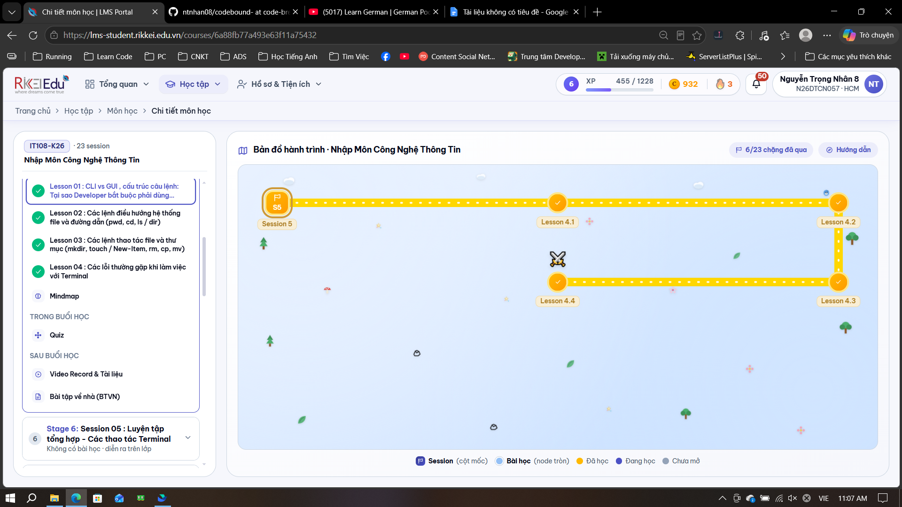

  
  &nbsp;&nbsp;&nbsp;&nbsp;
  ✕
  &nbsp;&nbsp;&nbsp;&nbsp;
  

# **Báo Cáo Elearning**

## **Lesson 1:**

### 1\. Học về cái gì?

Nội dung bài học tập trung vào Giao diện dòng lệnh (CLI \- Command Line Interface), đối lập với Giao diện đồ họa (GUI \- Graphical User Interface), cụ thể bao gồm:

* Lịch sử phát triển và so sánh giữa CLI và GUI: Khảo sát cách thao tác thủ công bằng chuột trên GUI so với việc tự động hóa bằng dòng lệnh trên bản văn bản CLI.  
* Cấu trúc cú pháp lệnh và môi trường Terminal: Tìm hiểu công thức chuẩn gồm 3 thành phần của một câu lệnh (\[Command\] \[Flags/Options\] \[Arguments\]) trên các hệ điều hành như Windows (PowerShell) và macOS (Zsh Terminal).  
* Vai trò của CLI trong môi trường nghề nghiệp: Phân tích tầm quan trọng của kỹ năng dòng lệnh đối với các vị trí kỹ thuật như DevOps & Cloud Engineer, Backend & Web Developer, và Data & AI Engineer.

### 2\. Tại sao phải học kiến thức này (giúp gì cho chúng ta)?

* Tự động hóa và tối ưu hiệu suất: Thay vì làm thủ công tốn hàng phút hoặc hàng giờ với giao diện đồ họa, CLI cho phép thực hiện hàng loạt tác vụ chỉ bằng một dòng lệnh duy nhất (ví dụ: tạo 100 thư mục chỉ trong 0.2 giây).  
* Tiết kiệm tài nguyên hệ thống: CLI cực kỳ nhẹ, hầu như không tốn tài nguyên CPU/RAM của máy chủ, cho phép viết các Shell Script để hệ thống tự động backup và deploy 24/7.  
* Chuẩn mực trong ngành kỹ thuật: Kỹ năng thao tác dòng lệnh là tiêu chí phân loại rõ nét nhất giữa một "người dùng máy tính phổ thông" và một "kỹ sư phát triển phần mềm chuyên nghiệp" trong các buổi phỏng vấn kỹ thuật.

### 3\. Tóm tắt kiến thức đã học qua E-learning

* Giao diện dòng lệnh (CLI) vs. Giao diện đồ họa (GUI): GUI trực quan nhưng chậm và tốn tài nguyên khi thao tác số lượng lớn; trong khi CLI siêu nhanh, tiết kiệm tài nguyên và dễ dàng tự động hóa qua kịch bản (Script).  
* Cấu trúc câu lệnh Terminal: Mọi câu lệnh đều được cấu thành từ 3 phần:  
  * Command (Lệnh): Hành động cốt lõi cần thực thi (ví dụ: ls).  
  * Flags / Options (Cờ/Tùy chọn): Các tùy chỉnh bổ sung cho lệnh (ví dụ: \-l \-a).  
  * Arguments (Đối tượng/Tham số): Đối tượng chịu tác động của lệnh (ví dụ: /Users/Student).  
* Ứng dụng thực tế theo chuyên môn:  
  * DevOps & Cloud Engineer: Quản lý hàng nghìn máy chủ AWS/Azure từ xa qua giao thức bảo mật SSH hoàn toàn bằng dòng lệnh.  
  * Backend & Web Developer: Khởi chạy máy chủ cơ sở dữ liệu, quản lý phiên bản Git, và cấu hình môi trường production.  
  * Data & AI Engineer: Kích hoạt các cụm máy tính tính toán song song để huấn luyện mô hình trí tuệ nhân tạo trên cụm GPU server.

### 4\. Câu hỏi thắc mắc để hôm sau thầy sẽ giải đáp

* Khi nào chúng ta nên ưu tiên sử dụng PowerShell (trên Windows) và khi nào nên dùng Bash/Zsh (trên macOS/Linux) để tối ưu hóa hiệu quả viết script?  
* Trong trường hợp một câu lệnh CLI chạy sai tham số (Arguments/Flags) gây ảnh hưởng đến hệ thống máy chủ production, có những cơ chế khẩn cấp hoặc lệnh an toàn nào để hoàn tác (rollback) nhanh chóng không ạ?

## **Lesson 2:**

### 1\. Học về cái gì?

Nội dung bài học tập trung vào cách làm chủ câu lệnh điều hướng trong hệ thống tệp tin (pwd, cd, ls / dir) và cách hiểu bản chất đường dẫn:

* Phân biệt đường dẫn tuyệt đối (Absolute Path) và đường dẫn tương đối (Relative Path): So sánh định vị GPS tuyệt đối với tọa độ tương đối từ vị trí hiện tại (CWD \- Current Working Directory), cùng các ký hiệu quy ước (., .., \~) trên cả Windows và macOS/Linux.  
* Cấu trúc cây thư mục và cơ chế điều hướng: Cách di chuyển qua lại giữa các phân cấp thư mục gốc (Root), thư mục người dùng, thư mục dự án (cd, cd .., cd \~) và các lệnh liệt kê tệp tin (Get-ChildItem \-Force trên PowerShell, ls \-la trên Zsh Terminal).  
* Quản trị đường dẫn trong dự án phần mềm quy mô lớn: Tìm hiểu tầm quan trọng của đường dẫn tương đối để đảm bảo tính đóng gói dự án di động (Portability) giữa các hệ điều hành khác nhau và bảo mật các tệp tin cấu hình nhạy cảm (.env).  
* Bảng tra cứu lệnh và các lưu ý quan trọng (Gotchas): Quy chuẩn về dấu gạch chéo (/ vs \\), cách dùng phím tắt Tab để tự động điền tên thư mục, và các lệnh cốt lõi trên PowerShell so với Zsh.

### 2\. Tại sao phải học kiến thức này (giúp gì cho chúng ta)?

* Định vị chính xác trong không gian máy chủ: Giúp lập trình viên không bị "lạc đường" khi thao tác trên các hệ thống không có giao diện đồ họa (như máy chủ Linux từ xa qua SSH), biết rõ mình đang ở đâu (pwd) và cách di chuyển đến bất kỳ file/thư mục nào ngay lập tức.  
* Đảm bảo mã nguồn chạy được trên mọi máy (Portability): Sử dụng đường dẫn tương đối giúp mã nguồn của dự án khi đem chạy trên Windows của bạn, macOS đồng nghiệp hay máy chủ Linux đều không bị lỗi đường dẫn hay gãy hình ảnh/tài nguyên.  
* Bảo mật thông tin hệ thống: Hiểu rõ cách thức ẩn tệp tin (như tệp chứa mật khẩu Database .env bắt đầu bằng dấu chấm) giúp tránh lộ thông tin cấu hình nhạy cảm khi viết mã.  
* Tăng tốc độ thao tác: Biết tận dụng phím Tab để tự động hoàn tất tên thư mục và tránh các lỗi cú pháp cơ bản giúp tiết kiệm hàng loạt thời gian làm việc thực tế.

### 3\. Tóm tắt kiến thức đã học qua E-learning

* Đường dẫn (Path):  
  * Tuyệt đối: Luôn bắt đầu từ thư mục gốc (/ trên macOS/Linux hoặc C:\\ trên Windows).  
  * Tương đối: Tính từ vị trí hiện tại (CWD) dựa vào các ký hiệu: . (thư mục hiện tại), .. (thư mục cha), \~ (thư mục cá nhân/Home).  
* Bảng tra cứu các lệnh điều hướng cơ bản:  
  * Xem vị trí hiện tại: pwd (cả Windows PowerShell và macOS Zsh).  
  * Về thư mục Home: cd \~.  
  * Lùi 1 cấp cha: cd ...  
  * Xem tệp ẩn: Dùng Get-ChildItem \-Force trên PowerShell hoặc ls \-la trên Zsh.  
* Các lưu ý quan trọng (Gotchas):  
  * Windows chuẩn là dấu suy ngược \\ (ví dụ: cd src\\app), trong khi macOS chuẩn là dấu / (ví dụ: cd src/app).  
  * Gõ lệnh cd ngay tại Terminal sẽ đưa ngay về thư mục Home an toàn.  
  * Nên tận dụng phím Tab để tránh lỗi gõ sai tên thư mục có khoảng trắng (ví dụ: My Folder).

### 4\. Câu hỏi thắc mắc để hôm sau thầy sẽ giải đáp

* Khi một ứng dụng web chạy trên môi trường Production (Linux) nhưng được phát triển trên máy cá nhân (Windows), làm thế nào để xử lý triệt để các lỗi xung đột dấu gạch chéo đường dẫn (/ và \\) một cách tự động mà không phải sửa tay ạ?  
* Khi sử dụng lệnh liệt kê tệp ẩn (ls \-la hoặc Get-ChildItem \-Force), có những tệp hệ thống quan trọng nào khác ngoài tệp .env mà chúng ta cần đặc biệt lưu ý không đưa lên các mã nguồn công khai (như GitHub) ạ?

## **Lesson 3:**

### 1\. Học về cái gì?

* Nội dung bài học tập trung vào bộ lệnh thực hiện chu trình CRUD (Create, Read, Update/Move, Delete) đối với tệp tin và thư mục.  
* Tìm hiểu nguyên lý đệ quy (Recursion) khi xử lý các thư mục có chứa thư mục con và tệp bên trong.  
* Đối chiếu song song các câu lệnh thao tác tương đương giữa hai hệ điều hành Windows (PowerShell) và macOS/Linux (Zsh Terminal).  
* Ứng dụng thực tiễn để viết các Automation Scaffolding Script giúp tự động hóa việc khởi tạo toàn bộ khung dự án lập trình chỉ với một câu lệnh.  
   

### 2\. Tại sao phải học kiến thức này (giúp gì cho chúng ta)?

* Tự động hóa thiết lập dự án: Giúp lập trình viên chỉ cần chạy một script duy nhất là có thể dựng lên toàn bộ cấu trúc thư mục, tệp cấu hình và mã nguồn mẫu trong chớp mắt.  
* Quản trị hệ thống hiệu quả: Giúp làm chủ các thao tác quản lý tệp tin trên máy chủ từ xa hoặc trong các môi trường không có giao diện đồ họa.  
* Tránh các rủi ro mất mát dữ liệu: Nắm rõ các cảnh báo an toàn ("cạm bẫy" dữ liệu) giúp lập trình viên tránh được việc xóa nhầm hoặc ghi đè đè file quan trọng không thể khôi phục.

### 3\. Tóm tắt kiến thức đã học qua E-learning

* Chu trình CRUD và Nguyên lý đệ quy:  
  * Các thao tác gồm: Tạo mới, Đọc nội dung, Sao chép/Di chuyển, và Xóa bỏ.  
  * Thao tác trên thư mục chứa cây thư mục con bắt buộc phải dùng cơ chế đệ quy (-r trên macOS/Linux hoặc \-Recurse trên Windows).  
* Các trụ cột lệnh chính:  
  * Trụ cột 1 (Tạo & Đọc): Dùng mkdir \-p để tạo thư mục nhiều cấp; dùng touch hoặc New-Item để tạo file; dùng cat hoặc Get-Content để đọc nội dung file trực tiếp trên Terminal.  
     \+ 2  
  * Trụ cột 2 (Copy & Di chuyển): Dùng cp hoặc Copy-Item để sao chép; dùng mv hoặc Move-Item để di chuyển hoặc đổi tên.  
     \+ 1  
  * Trụ cột 3 (Xóa dữ liệu): Dùng rm hoặc Remove-Item kèm cờ đệ quy để xóa thư mục.  
       
* Các cảnh báo an toàn dữ liệu (Gotchas):  
  * Lệnh rm và Remove-Item xóa trực tiếp khỏi ổ cứng, không đưa vào Thùng rác và không thể bấm Ctrl \+ Z để hoàn tác.  
  * Luôn kiểm tra kỹ vị trí hiện tại bằng lệnh pwd trước khi thực thi lệnh xóa.  
  * Các lệnh cp hoặc mv khi trùng tên sẽ tự động ghi đè file có sẵn mà không có bảng cảnh báo.

### 4\. Câu hỏi thắc mắc để hôm sau thầy sẽ giải đáp

* Khi vô tình thực thi lệnh xóa nhầm một thư mục quan trọng bằng rm \-rf trên Linux hoặc PowerShell mà chưa kịp sao lưu, có công cụ dòng lệnh nào hỗ trợ khôi phục lại dữ liệu đã xóa trực tiếp từ phân vùng ổ cứng không ạ?  
* Làm thế nào để thiết lập tùy chọn nhắc xác nhận (prompt confirmation) mặc định cho các lệnh cp hoặc mv nhằm tránh việc vô tình ghi đè đè lên các tệp tin quan trọng có sẵn?

## **Lesson 4:**

### 1\. Học về cái gì?

Nội dung bài học tập trung vào kỹ năng chẩn đoán và khắc phục 4 lỗi kinh điển thường gặp khi thao tác với dòng lệnh Terminal (Command Not Found, Permission Denied, No such file, File exists). Cụ thể bao gồm:

* Cách đọc và giải mã thông báo lỗi (Error Message): Xem thông báo lỗi không phải là dấu chấm hết mà là "tấm bản đồ chỉ đường" giúp xác định chính xác hệ thống đang gặp vấn đề gì.  
* Quy trình xử lý lỗi phổ biến: Tập trung phân tích nguyên nhân và cách khắc phục lỗi Command Not Found / Is Not Recognized (do sai chính tả, chưa cài phần mềm, hoặc lỗi biến môi trường PATH) trên cả Windows và macOS.  
* Nguyên tắc đặc quyền tối thiểu (Principle of Least Privilege): Tìm hiểu cách bảo vệ hệ thống bằng cách hạn chế sử dụng quyền Admin/Root và cẩn trọng với mã nguồn lạ từ Internet.

### 2\. Tại sao phải học kiến thức này (giúp gì cho chúng ta)?

* Bình tĩnh xử lý khi gặp lỗi dòng lệnh: Giúp lập trình viên không bị hoảng loạn trước màn hình thông báo lỗi màu đỏ, thay vào đó biết cách đọc log để tự sửa lỗi chỉ trong vài giây.  
* Nâng cao tư duy gỡ lỗi (Debugging mindset): Hiểu rõ bản chất vì sao lỗi xảy ra (do sai đường dẫn, thiếu cài đặt hay sai quyền hạn) thay vì đoán mò, giúp tiết kiệm hàng giờ liền loay hoay tìm cách giải quyết.  
* Đảm bảo an toàn bảo mật hệ thống: Tránh được thói quen xấu là lạm dụng quyền quản trị tối cao (sudo/Administrator) hoặc chạy các đoạn mã nguồn độc hại tải từ trên mạng vào Terminal.

### 3\. Tóm tắt kiến thức đã học qua E-learning

* Cấu trúc chung của một dòng thông báo lỗi: Thường có dạng \[Chương trình gây lỗi\] : \[Mã lỗi / Đường dẫn\] : \[Lý do chi tiết\] (Ví dụ: zsh: no such file or directory: app.js).  
* Chi tiết lỗi Command Not Found:  
  * Nguyên nhân: Gõ sai chính tả tên lệnh, chưa cài đặt phần mềm, hoặc phần mềm chưa được khai báo vào biến môi trường PATH.  
  * Cách xử lý: Kiểm tra lại tên lệnh, cài đặt bổ sung công cụ (ví dụ dùng brew install git trên macOS), hoặc cấu hình lại biến môi trường.  
* Các lưu ý quan trọng (Gotchas) khi xử lý lỗi:  
  * Luôn đọc 1–2 dòng thông báo CUỐI CÙNG, vì đó là nơi chứa thông tin quan trọng nhất của lỗi.  
  * Tuyệt đối không lạm dụng sudo để "chữa cháy" khi gặp lỗi Permission Denied trong trường hợp thực chất bạn chỉ đang đứng sai thư mục.  
  * Luôn tận dụng phím Tab để hệ thống tự động điền tên, tránh lỗi gõ sai chính tả hoặc sai chữ hoa/thường.

### 4\. Câu hỏi thắc mắc để hôm sau thầy sẽ giải đáp

* Khi gặp lỗi Permission Denied do đứng sai thư mục thay vì thiếu quyền, làm thế nào để sử dụng dòng lệnh nhanh chóng kiểm tra xem mình đang đứng ở thư mục nào và quyền hạn hiện tại của tệp tin đó ra sao ạ?  
* Nếu một dòng lệnh cài đặt phần mềm bên thứ ba làm thay đổi cấu hình biến môi trường PATH và làm hỏng các lệnh hệ thống cũ, có lệnh nào để reset hoặc khôi phục lại PATH mặc định ban đầu không ạ?

  

